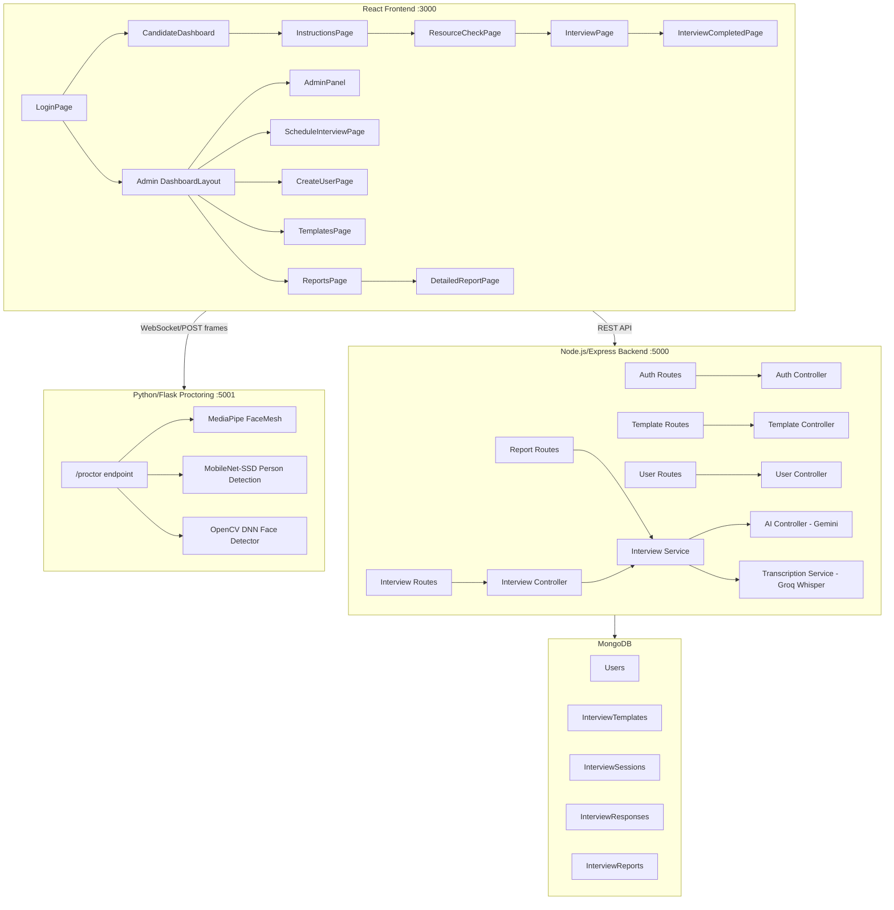
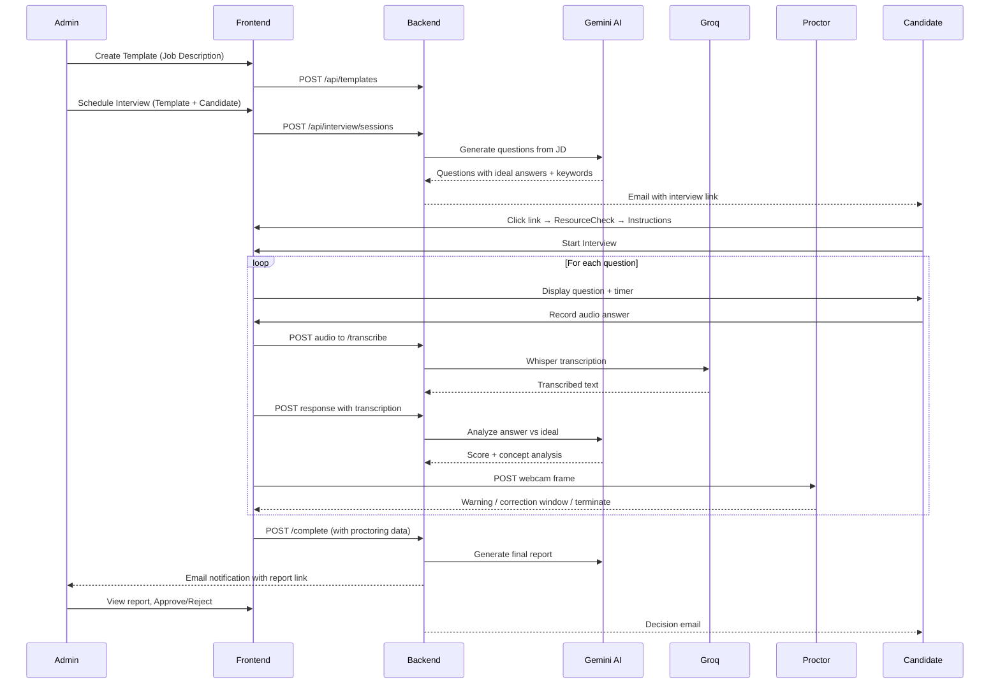

# InterviewApp-AI — Full Project Analysis

## Overview

This is a **full-stack AI-powered interview platform** that enables organizations to create interview templates, invite candidates, conduct AI-proctored interviews with real-time cheating detection, and generate comprehensive performance reports.

---

## Architecture

---

## Technology Stack

| Layer | Technologies |
|---|---|
| **Frontend** | React 18, MUI v7, Tailwind CSS 3, Recharts, React Router v7, React Markdown |
| **Backend** | Node.js, Express 4, Mongoose 8, JWT (jsonwebtoken), bcryptjs, Nodemailer |
| **AI/ML** | Google Gemini 1.5 Flash (`@google/generative-ai`), Groq Whisper API, `string-similarity` |
| **Proctoring** | Python Flask, OpenCV DNN, MediaPipe FaceMesh & Holistic, MobileNet-SSD |
| **Database** | MongoDB |
| **Export** | PDFKit, json2csv |

---

## Backend Deep-Dive

### Database Models (5 models)

| Model | Purpose | Key Fields |
|---|---|---|
| **User** | All platform users | email, password (bcrypt, salt 12), firstName, lastName, role (`admin`, `interviewer`, `candidate`, `hr_manager`, `ml_engineer`), isActive |
| **InterviewTemplate** | Interview blueprints | title, jobDescription, numberOfQuestions, durationMinutes, difficultyLevel, createdBy (ref User) |
| **InterviewSession** | Active interview instances | uniqueLink (UUID), template (ref), candidate (ref), interviewer (ref), questions (embedded generated), status (`scheduled` → `in_progress` → `completed`/`terminated`), proctoring fields, decision (approved/rejected) |
| **InterviewResponse** | Individual Q&A responses | session (ref), question (subdoc ref), audioFileUrl, transcribedText, aiScore (0-100), aiFeedback, keywordsMatched |
| **InterviewReport** | Final AI-generated reports | session (ref, unique), overallScore, skillScores (technical/communication/behavioral/problemSolving), detailedAnalysis, strengths, areasForImprovement, recommendation (`strong_hire`/`hire`/`maybe`/`no_hire`) |

### AI Pipeline

1. **Question Generation** → Gemini 1.5 Flash generates N questions from a job description, each with `idealAnswer` and `keywords`
2. **Audio Transcription** → Groq Whisper API transcribes candidate audio responses
3. **Answer Scoring** → Weighted formula: **95% AI keyword match + 5% string-similarity** (Dice coefficient)
4. **Semantic Concept Analysis** → Gemini determines which key concepts are mentioned vs. missed
5. **Final Report Generation** → Gemini produces comprehensive evaluation with skill scores, strengths, improvements, and hiring recommendation

### API Routes

| Route Prefix | Purpose |
|---|---|
| `/api/auth` | Register, Login (JWT) |
| `/api/interview` | Session CRUD, submit responses, transcribe audio, mark completed/terminated, submit admin decisions |
| `/api/templates` | Template CRUD |
| `/api/users` | User management, profile, password change, dashboard stats |
| `/api/reports` | Report generation, retrieval, export (CSV/PDF), filtered batch exports |

### Security
- JWT authentication with 30-day expiration
- bcrypt password hashing (salt rounds: 12)
- Password field excluded from queries by default (`select: false`)
- CORS restricted to `http://localhost:3000`

---

## Proctoring Microservice Deep-Dive

The Python Flask service at port `5001` performs **real-time computer vision analysis** on webcam frames:

### Detection Pipeline
1. **MobileNet-SSD** — Counts people in frame (person class ID 15)
2. **MediaPipe FaceMesh** — Detects up to 5 faces with 468 landmarks
3. **Pose Estimation** — 6-point `solvePnP` calculates head yaw/pitch using a 3D model
4. **Frontal vs. Profile Classification** — Uses eye distance, eye alignment, and nose centering heuristics

### Infraction Types
| Type | Trigger |
|---|---|
| [no_face](file:///e:/InterviewApp-AI-main/InterviewApp-AI-main/interview-backend/proctor_api.py#149-153) | No face detected in frame |
| `multiple_faces` | >1 face or person detected |
| `profile_face` | Eyes not aligned / not facing camera directly |

### Warning System
- **4 warnings max** before automatic termination
- Each infraction starts an **8-second correction window**
- If corrected in time → warning stays but session continues
- If not corrected → **immediate session termination**

---

## Frontend Deep-Dive

### Routing (custom state-based, no React Router used for routing)

The app uses `useState(path)` for navigation instead of React Router's `<BrowserRouter>`.

### Pages (16 total)

| Page | Role | Purpose |
|---|---|---|
| `LoginPage` | All | JWT email/password login |
| `CandidateDashboard` | Candidate | View scheduled & completed interviews |
| `DashboardPage` | Admin | General dashboard |
| `AdminPanel` | Admin | Main admin overview with stats |
| `ScheduleInterviewPage` | Admin | Schedule interviews (pick template + candidate) |
| `CreateUserPage` | Admin | Create new users with role |
| `TemplatesPage` | Admin | Create/manage interview templates |
| `ReportsPage` | Admin | Browse completed sessions with filtering, approve/reject candidates |
| `SettingsPage` | Admin | Admin settings |
| `InstructionsPage` | Candidate | Pre-interview instructions |
| `ResourceCheckPage` | Candidate | Camera/microphone permissions check |
| `InterviewPage` | Candidate | Live interview with recording, proctoring, and AI evaluation |
| `InterviewCompletedPage` | Candidate | Post-interview confirmation |
| `DetailedReportPage` | Both | Full interview report with scores, charts, Q&A breakdown |
| `NotFoundPage` | All | 404 error |
| `ServerErrorPage` / `NetworkErrorPage` | All | Error states |

### Key Components

| Component | Purpose |
|---|---|
| `DashboardLayout` | Admin sidebar navigation layout |
| `AudioRecorder` | Browser-based audio recording for candidate answers |
| `ScoreCard` | Displays individual score metrics |
| `SkillsRadarChart` | Recharts radar chart for skill visualization |
| `SummaryDonut` | Donut chart for score summary |
| `DetailedAnalysisView` | Per-question breakdown with scores |
| `RecommendationsView` | AI hiring recommendations display |
| `SummaryAndFeedback` | Interview summary and feedback display |

### UI Theme
- **Dark mode** with gold/yellow accent (`#FFE066`, `#FFD133`)
- Background: `#181818` / `#232526`
- Font: Inter, Roboto
- Glassmorphism-style sidebar

---

## Environment Variables

| Variable | Service | Purpose |
|---|---|---|
| `MONGO_URI` | Backend | MongoDB connection string |
| `JWT_SECRET` | Backend | JWT signing secret |
| `GEMINI_API_KEY` | Backend | Google Gemini AI API key |
| `GROQ_API_KEY` | Backend | Groq Whisper transcription key |
| `SENDER_EMAIL` / `SENDER_PASSWORD` | Backend | Email credentials for Nodemailer |
| `FRONTEND_URL` | Backend | Frontend URL for email links |

---

## Potential Issues & Observations

> [!WARNING]
> **Hardcoded API key in config** — The Groq API key is hardcoded as a fallback in [index.js](file:///e:/InterviewApp-AI-main/InterviewApp-AI-main/interview-backend/src/config/index.js#L11). This is a security risk.

> [!WARNING]
> **CORS hardcoded to localhost** — [app.js](file:///e:/InterviewApp-AI-main/InterviewApp-AI-main/interview-backend/app.js#L26) restricts CORS to `http://localhost:3000`. This will break in production/deployment.

> [!IMPORTANT]
> **Duplicate schema field** — [interviewReport.model.js](file:///e:/InterviewApp-AI-main/InterviewApp-AI-main/interview-backend/src/models/interviewReport.model.js) defines `detailedAnalysis` twice (line 56 as Mixed, line 82 as Array). Mongoose will use the last definition.

> [!NOTE]
> **No React Router for navigation** — The frontend uses manual `path` state management instead of `<BrowserRouter>`. This means browser back/forward buttons and direct URL access won't work correctly.

> [!NOTE]
> **Frontend has a nested `interview-backend` folder** — There's an `interview-backend` directory inside `interview-frontend/` which appears to be a duplicate or leftover.

> [!CAUTION]
> **Proctoring runs on port 5001 in code but docs say 8000** — [proctor_api.py](file:///e:/InterviewApp-AI-main/InterviewApp-AI-main/interview-backend/proctor_api.py#L644) runs on port `5001`, but [info.md](file:///e:/InterviewApp-AI-main/InterviewApp-AI-main/info.md#L78) says port `8000`.

> [!NOTE]
> **In-memory session data for proctoring** — The proctoring service stores session data in a Python dict (`session_data = {}`). This will be lost on server restart and won't scale across multiple instances.

---

## Data Flow Summary

